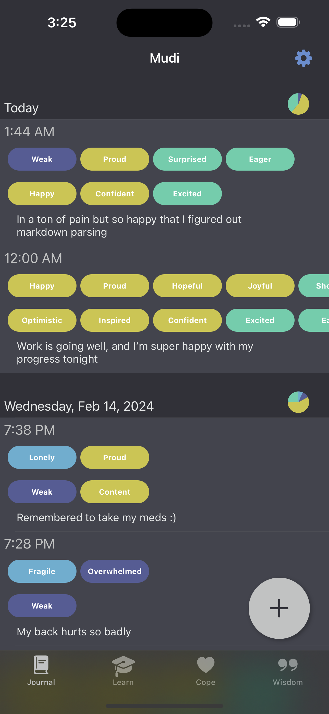

<!-- Improved compatibility of back to top link: See: https://github.com/othneildrew/Best-README-Template/pull/73 -->

<!--
*** Thanks for checking out the Best-README-Template. If you have a suggestion
*** that would make this better, please fork the repo and create a pull request
*** or simply open an issue with the tag "enhancement".
*** Don't forget to give the project a star!
*** Thanks again! Now go create something AMAZING! :D
-->

<!-- PROJECT SHIELDS -->
<!--
*** I'm using markdown "reference style" links for readability.
*** Reference links are enclosed in brackets [ ] instead of parentheses ( ).
*** See the bottom of this document for the declaration of the reference variables
*** for contributors-url, forks-url, etc. This is an optional, concise syntax you may use.
*** https://www.markdownguide.org/basic-syntax/#reference-style-links
-->
[![Contributors][contributors-shield]][contributors-url]
[![Forks][forks-shield]][forks-url]
[![Stargazers][stars-shield]][stars-url]
[![Issues][issues-shield]][issues-url]
[![LinkedIn][linkedin-shield]][linkedin-url]

<!-- PROJECT LOGO -->
 

  

<h3 align="center">Mood Tracker</h3>

  

    Mood Tracker is an iOS app that allows users to log their mood throughout the week based on the “Feelings Wheel” created by Dr. Gloria Willcox.
     
    Easily log exactly how you feel by tapping any of the 75+ choices
    Keep track of how you've been feeling with a nice UI with color coded mood cells for 6 categories of feelings - Sad, Mad, Scared, Peaceful, Powerful, and Joyful
     
    <ul>
        <li><a href="https://github.com/firebase/firebase-ios-sdk">Firebase</a> is used for authentication and databases. </li>
        <li>Using the <a href="https://github.com/annthurium/affirmations">affirmations.dev</a> API, you can easily get affirmations in the app to make you feel better. </li>
        <li>UPDATE: Animated pie charts to help visually analyse your day</li>
    </ul>
        
    Hope you like it! -Alex
     
    <a href="https://github.com/emcassi/mood-tracker-ios"><strong>Explore the docs »</strong></a>
     
     
    ·
    <a href="https://github.com/emcassi/mood-tracker-ios/issues">Report Bug</a>
    ·
    <a href="https://github.com/emcassi/mood-tracker-ios/issues">Request Feature</a>
  

<!-- TABLE OF CONTENTS -->

  
Table of Contents

  <ol>
    <li>
      <a href="#about-the-project">About The Project</a>
      <ul>
        <li><a href="#built-with">Built With</a></li>
      </ul>
    </li>
    <li>
      <a href="#getting-started">Getting Started</a>
      <ul>
        <li><a href="#prerequisites">Prerequisites</a></li>
        <li><a href="#installation">Installation</a></li>
      </ul>
    </li>
    <li><a href="#usage">Usage</a></li>
    <li><a href="#roadmap">Roadmap</a></li>
    <li><a href="#contributing">Contributing</a></li>
    <li><a href="#license">License</a></li>
    <li><a href="#contact">Contact</a></li>
    <li><a href="#acknowledgments">Acknowledgments</a></li>
  </ol>

<!-- ABOUT THE PROJECT -->
## About The Project

(<a href="#readme-top">back to top</a>)

### Built With

* [![Swift][Swift]][Swift-url]
* [![Firebase][Firebase]][Firebase-url]
* [![Charts][Chart]][Chart-url]
* [![Affirmations][Affs]][Affs-url]

(<a href="#readme-top">back to top</a>)

<!-- GETTING STARTED -->

## Installation

[Download it here](https://apps.apple.com/us/app/mood-tracker-log-and-journal/id6444286152)

(<a href="#readme-top">back to top</a>)

<!-- Screenshots -->
## Screenshots

 

 

(<a href="#readme-top">back to top</a>)

<!-- CONTACT -->
## Contact

Alex Wayne - [@emcassi_](https://twitter.com/emcassi_) - alex.wayne.dev@gmail.com

Project Link: [https://github.com/emcassi/mood-tracker-ios](https://github.com/emcassi/mood-tracker-ios)

Download Link: [https://apps.apple.com/us/app/mood-tracker-log-and-journal/id6444286152](https://apps.apple.com/us/app/mood-tracker-log-and-journal/id6444286152)

(<a href="#readme-top">back to top</a>)

(<a href="#readme-top">back to top</a>)

<!-- MARKDOWN LINKS & IMAGES -->
<!-- https://www.markdownguide.org/basic-syntax/#reference-style-links -->
[contributors-shield]: https://img.shields.io/github/contributors/emcassi/mood-tracker-ios.svg?style=for-the-badge
[contributors-url]: https://github.com/emcassi/mood-tracker-ios/graphs/contributors
[forks-shield]: https://img.shields.io/github/forks/emcassi/mood-tracker-ios.svg?style=for-the-badge
[forks-url]: https://github.com/emcassi/mood-tracker-ios/network/members
[stars-shield]: https://img.shields.io/github/stars/emcassi/mood-tracker-ios.svg?style=for-the-badge
[stars-url]: https://github.com/emcassi/mood-tracker-ios/stargazers
[issues-shield]: https://img.shields.io/github/issues/emcassi/mood-tracker-ios.svg?style=for-the-badge
[issues-url]: https://github.com/emcassi/mood-tracker-ios/issues
[license-shield]: https://img.shields.io/github/license/emcassi/mood-tracker-ios.svg?style=for-the-badge
[license-url]: https://github.com/emcassi/mood-tracker-ios/blob/master/LICENSE.txt
[linkedin-shield]: https://img.shields.io/badge/-LinkedIn-black.svg?style=for-the-badge&logo=linkedin&colorB=555
[linkedin-url]: https://linkedin.com/in/alex-wayne-a1800a263
[product-screenshot]: images/screenshot.png

[Swift]: https://img.shields.io/badge/swift-fff?style=for-the-badge&logo=swift&logoColor=orange
[Firebase]: https://img.shields.io/badge/firebase-1a73e8?style=for-the-badge&logo=firebase
[Chart]: https://img.shields.io/badge/charts-fff?style=for-the-badge
[Affs]: https://img.shields.io/badge/affirmations.dev-000?style=for-the-badge

[Swift-url]: https://developer.apple.com/swift
[Firebase-url]: https://github.com/firebase/firebase-ios-sdk
[Chart-url]: https://github.com/danielgindi/Charts
[Affs-url]: https://github.com/annthurium/affirmations